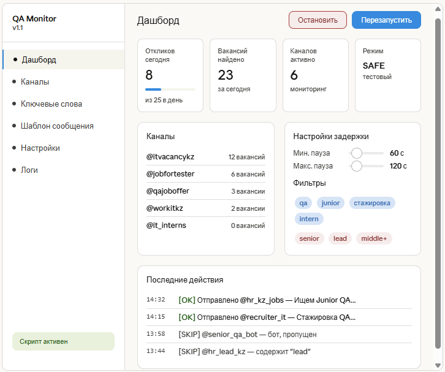

# 🤖 QA Vacancy Monitor

Автоматический мониторинг вакансий и стажировок для QA-тестировщиков в Telegram-каналах.

Скрипт отслеживает новые объявления в реальном времени, фильтрует подходящие по ключевым словам и автоматически отправляет отклик с резюме.

---

## 📸 Demo



---

## 🎯 Зачем этот проект

Поиск первой работы в QA — это сотни вакансий в десятках каналов. Вместо ручного мониторинга я автоматизировал процесс: скрипт работает в фоне и реагирует на новые объявления быстрее, чем я успеваю их прочитать.

---

## 📌 Roadmap

- [ ] GUI интерфейс
- [ ] Unit-тесты для логики фильтрации
- [ ] REST API (управление запуском/статусом)
- [ ] Улучшение алгоритма поиска контактов
- [ ] Рефакторинг и модульная архитектура

---

## ⚙️ Стек технологий

| Технология | Применение |
|---|---|
| Python 3.10+ | Основной язык |
| Telethon | Telegram MTProto API |
| asyncio | Асинхронная обработка событий |
| python-dotenv | Управление конфигурацией |
| Regex | Извлечение контактов из текста |

---

## 🚀 Функциональность

- **Мониторинг в реальном времени** — подписка на события новых сообщений через Telegram API
- **Умная фильтрация** — поиск по ключевым словам, исключение нерелевантных вакансий (Senior, Lead и т.д.)
- **Защита от дублей** — ведение лога отправленных контактов, повторная отправка исключена
- **Лимит сообщений** — не более 25 откликов в день (защита от блокировки)
- **Случайные задержки** — между откликами 60–120 секунд (имитация человека)
- **SAFE_MODE** — тестовый режим без реальной отправки
- **Архивирование логов** — ежедневные логи с автоматической архивацией
- **PID-управление** — корректный запуск/остановка через bat-скрипт
- **Автоперезапуск** — восстановление при потере соединения

---

## 📁 Структура проекта

```
QaVacancyMonitor/
├── monitor.py                  # Основной скрипт
├── Start_Stop_monitoring.bat   # Меню управления (Windows)
├── .env.example                # Шаблон переменных окружения
├── .env                        # Секреты (не в репозитории)
├── .gitignore
├── requirements.txt
├── logs/
│   ├── sent_log_YYYY-MM-DD.txt # Лог текущего дня
│   └── archive/                # Архив предыдущих дней
└── README.md
```

---

## 🔧 Установка и запуск

### 1. Клонировать репозиторий

```bash
git clone https://github.com/ВАШ_НИКНЕЙМ/QaVacancyMonitor.git
cd QaVacancyMonitor
```

### 2. Установить зависимости

```bash
pip install -r requirements.txt
```

### 3. Настроить окружение

```bash
cp .env.example .env
```

Заполнить `.env`:
```
TG_API_ID=ВАШ_ID        # с https://my.telegram.org/apps
TG_API_HASH=ВАШ_HASH
SAFE_MODE=true           # true = тест, false = боевой режим
```

### 4. Запустить

**Windows** — через меню:
```
Start_Stop_monitoring.bat
```

**Напрямую:**
```bash
python monitor.py
```

При первом запуске Telegram запросит номер телефона и код подтверждения — это стандартная авторизация через MTProto API.

---

## 📊 Пример лога

```
@hr_contact_1 | 2025-03-15 10:23:41 | Ищем Junior QA тестировщика, без опыта...
@recruiter_kz | 2025-03-15 11:05:17 | Стажировка QA — обучим с нуля...
```

---

## ⚠️ Ограничения

- Скрипт работает с публичными Telegram-каналами
- Используются ограничения на отправку сообщений для предотвращения блокировок
- Рекомендуется использовать SAFE_MODE для тестирования

---

## 🔍 QA Approach

В рамках проекта применены практики тестирования:

- Проверка бизнес-логики фильтрации (keywords / exclude)
- Контроль граничных условий (лимит сообщений в день)
- Обработка негативных сценариев (ошибки API, отсутствие контактов)
- Предотвращение дублей (проверка состояния системы)
- SAFE_MODE как аналог тестовой среды (staging)

Планируется:
- Покрытие логики unit-тестами
- Разработка тест-плана, тест-кейсов и чек-листов в папке `/docs`

Для безопасного тестирования используйте `SAFE_MODE=true` — скрипт будет логировать найденные контакты без реальной отправки.

---

## 👤 Автор

**Пак Виталий** — Junior QA Engineer

[](https://www.linkedin.com/in/vitaliy-pak-634a163b9)
[](https://www.notion.so/97f6c027176c83aaa56a019ee570248e)
[](https://github.com/Scr00ge90)
[](https://t.me/Scr00ge_3_16)

> Этот проект — часть моего портфолио. Демонстрирует навыки Python-автоматизации, работы с API, логирования и написания чистого кода.
